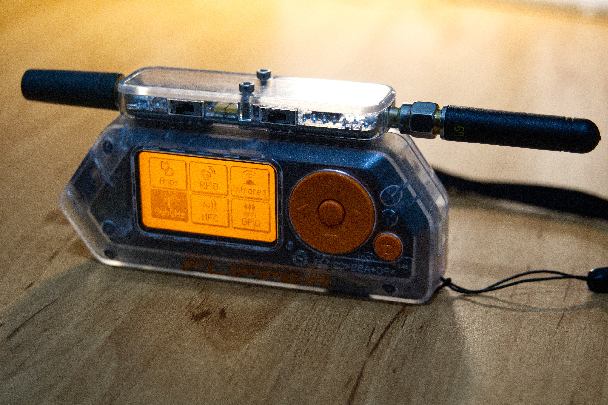
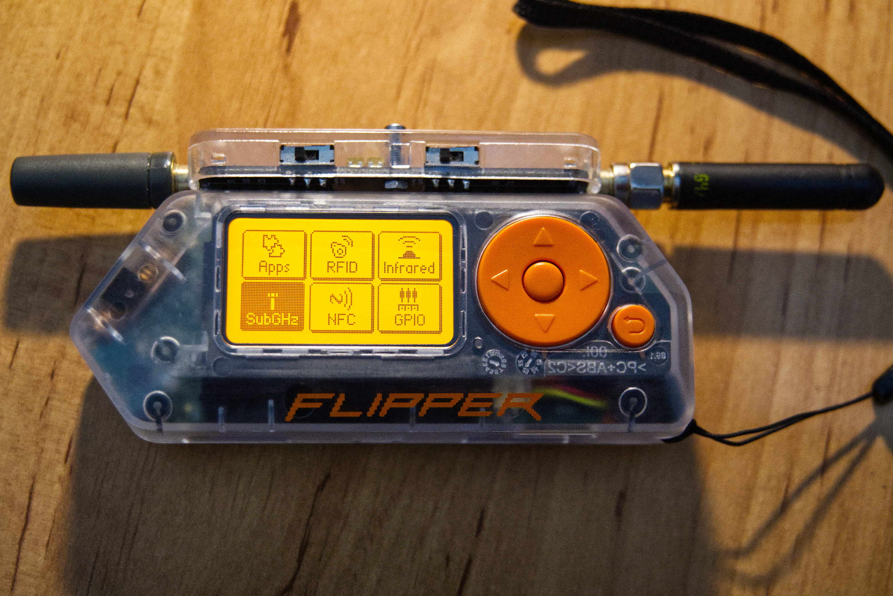
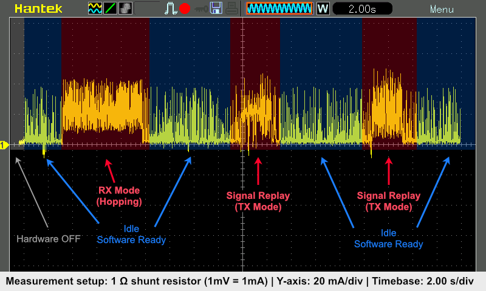
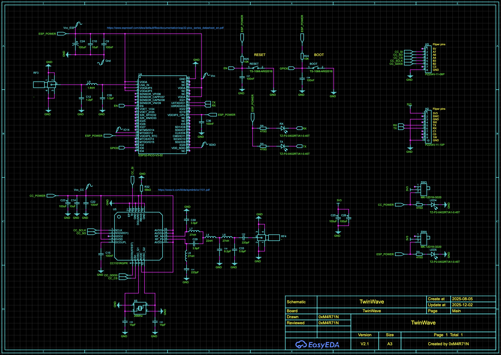
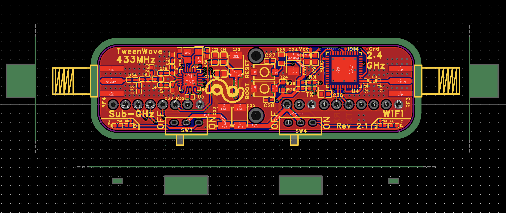
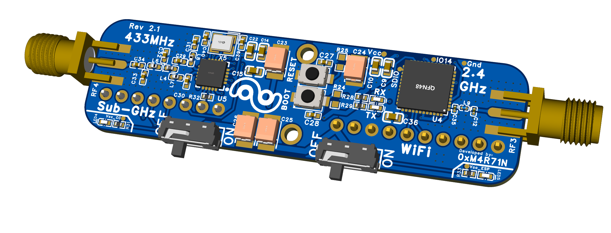
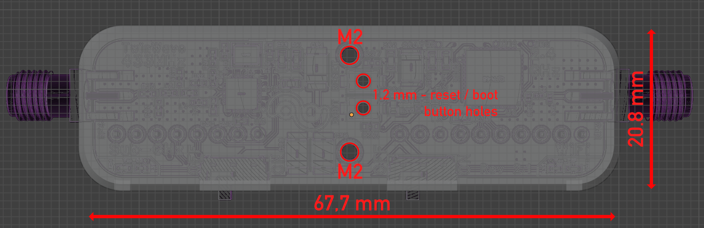

#### Wi‑Fi & Sub‑GHz GPIO Module for Flipper Zero

🌐 **[View Project Website](https://0xmartin.github.io/TwinWave/)** 🌐

📋 **[View PCB Project on OSHWLab](https://oshwlab.com/martin.krcma1/flipper-wifi-and-433mhz-shield)** 📋

Compact GPIO module designed for Flipper Zero, combining 2.4 GHz Wi-Fi and 433 MHz Sub-GHz.

<table>
<tr>
<td align="center" width="50%">

</td>
<td align="center" width="50%">

</td>
</tr>
</table>

 

 

<em>📺 Click to watch TwinWave in action on YouTube</em>

 

The module is designed to be **as compact as possible**, with replaceable antennas and the ability to remain permanently installed in the port. Two micro switches allow you to activate or deactivate the Wi‑Fi and Sub‑GHz radios, preventing unnecessary power draw when not in use.

 

### 📦 Manufacturing Files & Project

- **PCB Manufacturing:** Gerber files, Bill of Materials (BOM), and Pick and Place data for PCB manufacturing are available in the **[./hardware/export](./hardware/export)** directory.
- **EasyEDA Project:** The complete PCB project can be found in the **[./hardware](./hardware)** directory and can be opened in **EasyEDA Pro**.
- **PCB Stackup:** Use **JLC04161H-7628** (4-layer, 1.6mm, 7628 prepreg). This is a standard JLCPCB stackup with the following layer structure:
  | Layer | Material | Thickness |
  |-------|----------|----------|
  | Top Layer | Copper | 0.035mm |
  | Prepreg | 7628×1 | 0.21040mm |
  | Inner Layer L2 | Copper | 0.0152mm |
  | Core | Core | 1.065mm |
  | Inner Layer L3 | Copper | 0.0152mm |
  | Prepreg | 7628×1 | 0.21040mm |
  | Bottom Layer | Copper | 0.035mm |
  
  Total thickness: ~1.1mm H/HOZ with copper
 
> [!NOTE]
> **Pin Header Assembly:** It is recommended to **assemble the pin header yourself** (GPIO connector). This allows you to **adjust the pin length** to perfectly fit your specific Flipper Zero configuration – whether it has a protective case or not.

---

## ✨ Key Features

<table>
<tr>
<td width="50%">

### 🔌 Hardware
- **Dual radios** – Wi‑Fi 2.4 GHz + Sub‑GHz 433 MHz
- **Replaceable antennas** – 2× SMA female connectors
- **Power switches** – Independent Wi‑Fi/Sub‑GHz power control
- **Compact design** – Small form factor for easy use in any situation

</td>
<td width="50%">

### 💻 Software & Chips
- **ESP32-PICO-V3-02** – Wi‑Fi connectivity
- **TI CC1101** – Sub‑GHz transceiver
- **Marauder compatible** – ESP32 Marauder support
- **Easy updates** – UART firmware flashing

</td>
</tr>
</table>

---

## 📋 Technical Specifications

| Category | Details |
|----------|----------|
| **Radios** | Wi‑Fi 2.4 GHz (ESP32‑PICO‑V3‑02)   Sub‑GHz 433 MHz (TI CC1101) |
| **Antennas** | 2× SMA female connectors (Wi‑Fi + 433 MHz) |
| **Power** | Supplied from Flipper GPIO (3.3V, GND) |
| **ESP32 Interface** | UART/Serial via Flipper GPIO   Firmware update via external USB‑TTL |
| **CC1101 Interface** | SPI bus (shared with Flipper) |
| **Indicators** | Power LEDs and ESP32 RX and TX LEDs |
| **Compatibility** | Flipper Zero with GPIO header |
| **Dimensions** | Compact form factor, designed for permanent installation |

---

## ⚡ Power Consumption

<b>📊 Click to view Power Consumption Measurements</b>

 

Power consumption measured using oscilloscope in different operating modes:

<table>
    <tr>
        <td align="center">
             
            <strong>Evil Portal Mode</strong> – Power consumption during Evil Portal operation
        </td>
    </tr>
    <tr>
        <td align="center">
             
            <strong>ESP32 Deauth Detail</strong> – Detailed ESP32 power draw during deauthentication activity
        </td>
    </tr>
    <tr>
        <td align="center">
             
            <strong>CC1101 Detail</strong> – Detailed CC1101 power draw during read/replay activity
        </td>
    </tr>
</table>

> [!NOTE]
> These measurements help you understand the power requirements when using the module with Flipper Zero. Use the power switches to disable unused radios and save battery.

---

## ⚙️ Quick Start Guide

### Step-by-Step

1. **📡 Attach Antennas**
   - Connect 2.4 GHz antenna to the Wi‑Fi SMA connector
   - Connect 433 MHz antenna to the Sub‑GHz SMA connector

2. **🔌 Install Module**
   - Carefully plug the module onto Flipper Zero's GPIO header
   - Ensure proper alignment and secure connection

3. **⚡ Enable Radios**
   - Use micro switches to enable Wi‑Fi and/or Sub‑GHz as needed
   - LEDs will indicate active radios

4. **🚀 Start Experimenting**
   - Use Flipper's serial/terminal to interact with ESP32
   - Integrate CC1101 into your Sub‑GHz workflows

> [!WARNING]
> **Never transmit without antennas connected!** This can damage the RF stages.

---

## 🛠️ ESP32 Marauder Firmware

> [!NOTE]
> The firmware is a **port** of [ESP32 Marauder](https://github.com/justcallmekoko/ESP32Marauder) by **justcallmekoko**, specifically adapted for the `ESP32-PICO-V3-02` chip.

### 📥 Downloads & Flashing

Download precompiled binaries from repository releases: **`MARAUDER-vX.Y.Z-ESP32-PICO-V3-02.zip`**

#### ⚡ Web Flasher (Recommended)

The easiest way to flash firmware — directly from your browser, no installation required!

**[🚀 Open Web Flasher](https://0xmartin.github.io/TwinWave/flash.html)**

- ✓ Automatically downloads the latest firmware version
- ✓ Supports custom firmware upload
- ✓ Works in Chrome, Edge, and Opera browsers
- ✓ Step-by-step wizard guides you through the process

📖 **For manual flashing instructions and build guide, see [`firmware/README.md`](./firmware/README.md)**

---

## 📐 Technical Documentation

<b>🔍 Click to view Schematic</b>

 

    
    <em>Complete circuit schematic with pinout details</em>

<b>🔍 Click to view PCB Design</b>

 

    <table>
        <tr>
            <td align="center" width="50%">
                 
                <strong>Top View</strong> – Component placement
            </td>
            <td align="center" width="50%">
                 
                <strong>3D View</strong> – Layout visualization
            </td>
        </tr>
    </table>

<b>📦 Click to view Case Dimensions</b>

 

    
    <em>Case dimensions and form factor</em>

---

## ⚠️ RF Safety & Legal

> [!WARNING]
> - **NEVER transmit without antenna connected** – can damage RF stages
> - Use properly tuned antennas for 2.4 GHz and 433 MHz
> - User is **fully responsible** for legal compliance
> - **Lab/experimental use only** – not certified for commercial use
> - Do NOT use in life‑support or safety‑critical systems

---

## 📜 License & Credits

### License

**Hardware:** [CC-BY-NC-SA-4.0 (Creative Commons Attribution-NonCommercial-ShareAlike)](hardware/LICENSE.txt)

**Firmware:** [MIT License (Based on ESP32 Marauder)](firmware/LICENSE.txt)

For details, see the LICENSE file in each subfolder.

**NOTICE:** The firmware is a derivative work of ESP32 Marauder by justcallmekoko, used under the MIT License. See [firmware/NOTICE](firmware/NOTICE).

### 👨‍💻 Authors
<table>
<tr>
<td>

**🔧 Hardware Design**  
[0xM4R71N](https://github.com/0xMartin) – PCB design, 3D case, Marauder port for ESP32-PICO-V3-02

</td>
</tr>
<tr>
<td>

**💻 Original Firmware**  
[justcallmekoko](https://github.com/justcallmekoko) – ESP32 Marauder firmware author

</td>
</tr>
</table>

---

### 🌟 If you find this project useful, please consider giving it a star!

**Made with ❤️ for the Flipper Zero community**

