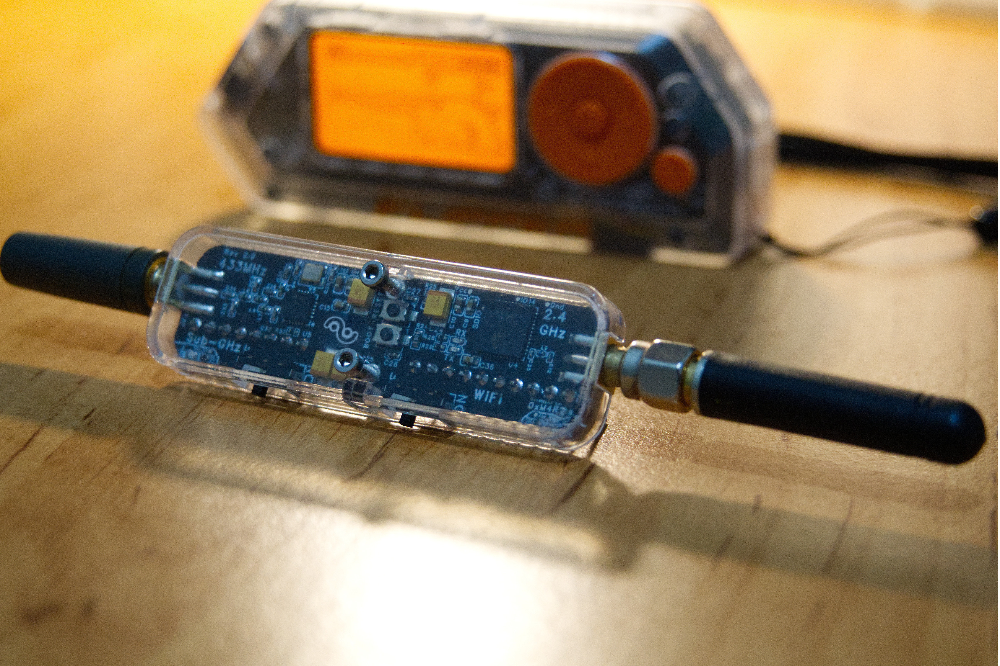
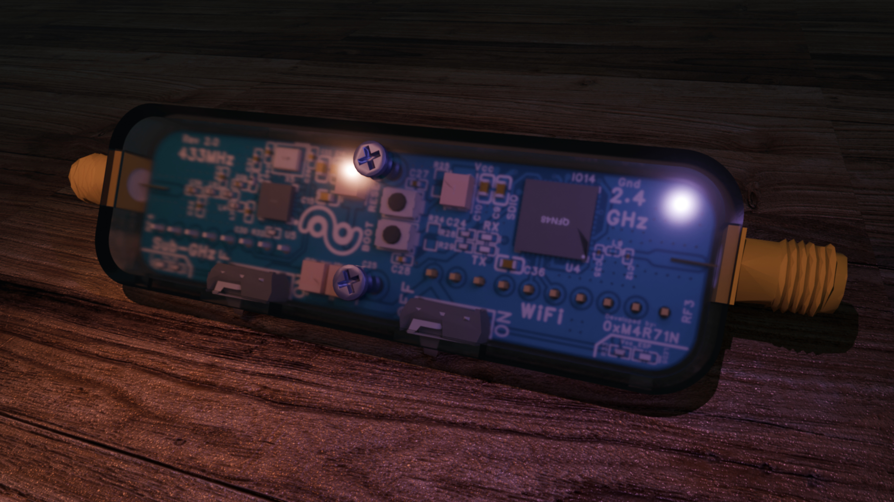
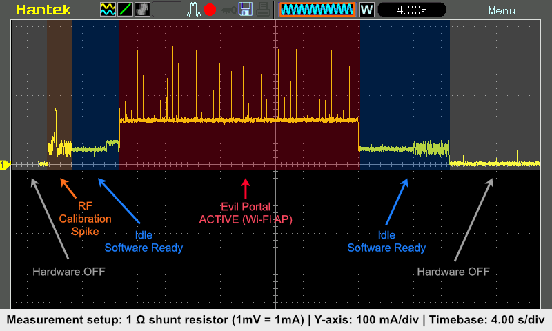
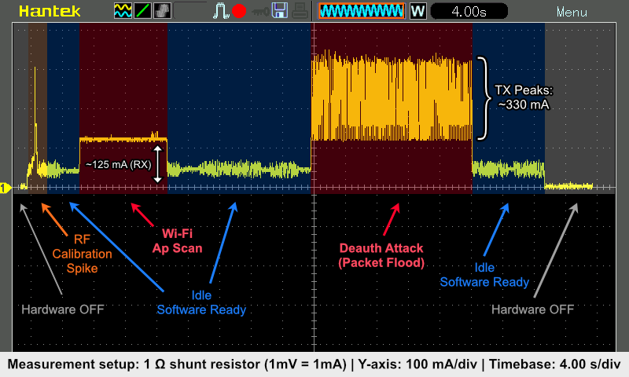
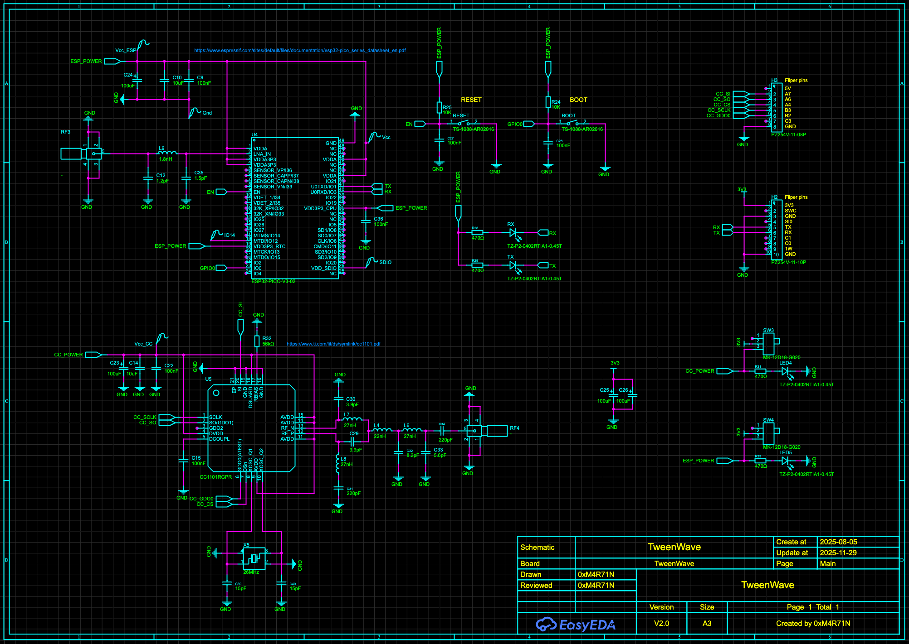
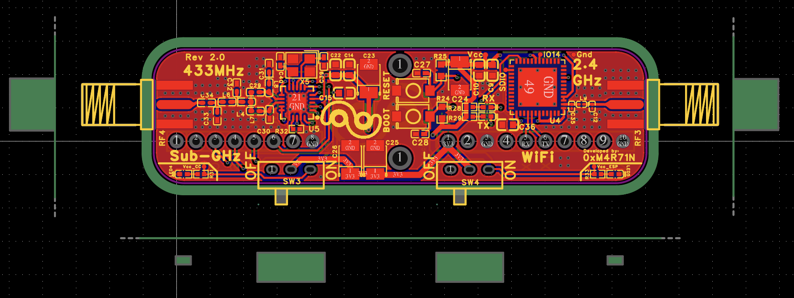
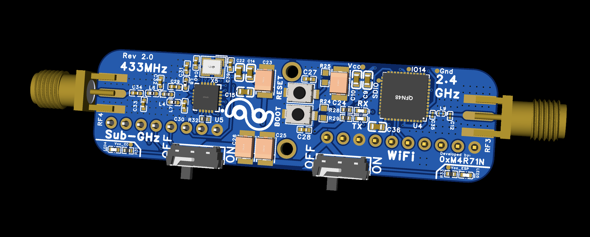

<div align="center">


#### Wi‑Fi & Sub‑GHz GPIO Module for Flipper Zero

[](#)
[](#)
[](#features)
[](#)

</div>

A compact GPIO module for Flipper Zero that combines 2.4 GHz Wi‑Fi and 433 MHz Sub‑GHz into one small board. Perfect for lab experiments, RF tinkering, and extending Flipper’s connectivity.

<div align="center">

<table>
    <tr>
        <td align="center" width="50%">
            <br/>
            <sub>📸 <strong>Actual TweenWave module</strong> (real photo)</sub>
        </td>
        <td align="center" width="50%">
            <br/>
            <sub>🎨 <strong>3D render</strong> (not a real photo)</sub>
        </td>
    </tr>
</table>

</div>

<br>

The module is designed to be **as compact as possible**, with replaceable antennas and the ability to remain permanently installed in the port. Two micro switches allow you to activate or deactivate the Wi‑Fi and Sub‑GHz radios, preventing unnecessary power draw when not in use.

<div align="center">

### 📌 Module in Action


<sub><em>TweenWave module plugged directly into the Flipper Zero GPIO port</em></sub>

</div>

<br>

> [!IMPORTANT]
> ### 📦 Manufacturing Files
> 
> Gerber files, Bill of Materials (BOM), and Pick and Place data for PCB manufacturing are available in the **[./export](./export)** directory.

---

## ✨ Key Features

<table>
<tr>
<td width="50%">

### 🔌 Hardware
- **Direct GPIO plug-in** – No wiring needed
- **Dual radios** – Wi‑Fi 2.4 GHz + Sub‑GHz 433 MHz
- **Replaceable antennas** – 2× SMA female connectors
- **Power switches** – Independent Wi‑Fi/Sub‑GHz control
- **Compact design** – Optimized RF layout

</td>
<td width="50%">

### 💻 Software & Chips
- **ESP32-PICO-V3-02** – Wi‑Fi connectivity
- **TI CC1101** – Sub‑GHz transceiver
- **Marauder compatible** – ESP32 Marauder support
- **Easy updates** – UART firmware flashing
- **Status LEDs** – Visual indicators

</td>
</tr>
</table>

---

## 📋 Technical Specifications

| Category | Details |
|----------|----------|
| **Radios** | Wi‑Fi 2.4 GHz (ESP32‑PICO‑V3‑02) <br> Sub‑GHz 433 MHz (TI CC1101) |
| **Antennas** | 2× SMA female connectors (Wi‑Fi + 433 MHz) |
| **Power** | Supplied from Flipper GPIO (3.3V, GND) |
| **ESP32 Interface** | UART/Serial via Flipper GPIO <br> Firmware update via external USB‑TTL |
| **CC1101 Interface** | SPI bus (shared with Flipper) |
| **Indicators** | Status and power LEDs |
| **Compatibility** | Flipper Zero with GPIO header |
| **Dimensions** | Compact form factor, designed for permanent installation |

> [!TIP]
> Exact pin mapping and signal routing are documented in the schematic below (📐 Technical Documentation section).

---

## ⚡ Power Consumption

<details>
<summary><b>📊 Click to view Power Consumption Measurements</b></summary>

<br>

Power consumption measured using oscilloscope in different operating modes:

<div align="center">

<table>
    <tr>
        <td align="center">
            <br/>
            <sub><strong>Evil Portal Mode</strong> – Power consumption during Evil Portal operation</sub>
        </td>
    </tr>
    <tr>
        <td align="center">
            <br/>
            <sub><strong>ESP32 Deauth Detail</strong> – Detailed ESP32 power draw during deauthentication activity</sub>
        </td>
    </tr>
    <tr>
        <td align="center">
            <br/>
            <sub><strong>CC1101 Detail</strong> – Detailed CC1101 power draw during portal activity</sub>
        </td>
    </tr>
</table>

</div>

> [!NOTE]
> These measurements help you understand the power requirements when using the module with Flipper Zero. Use the power switches to disable unused radios and save battery.

</details>

---

## ⚙️ Quick Start Guide

### Step-by-Step

1. **📡 Attach Antennas**
   - Connect 2.4 GHz antenna to the Wi‑Fi SMA connector
   - Connect 433 MHz antenna to the Sub‑GHz SMA connector

2. **🔌 Install Module**
   - Carefully plug the module onto Flipper Zero's GPIO header
   - Ensure proper alignment and secure connection

3. **⚡ Enable Radios**
   - Use micro switches to enable Wi‑Fi and/or Sub‑GHz as needed
   - LEDs will indicate active radios

4. **🚀 Start Experimenting**
   - Use Flipper's serial/terminal to interact with ESP32
   - Integrate CC1101 into your Sub‑GHz workflows

> [!WARNING]
> **Never transmit without antennas connected!** This can damage the RF stages.

---

## 🛠️ ESP32 Marauder Firmware

> [!NOTE]
> The firmware is a **port** of [ESP32 Marauder](https://github.com/justcallmekoko/ESP32Marauder) (v1.8.6) by **justcallmekoko**, specifically adapted for the `ESP32-PICO-V3-02` chip. The project has been migrated to PlatformIO for easier compilation and flashing.

### 📥 Precompiled Binaries

Download precompiled `.bin` files from repository releases: **`MARAUDER_v1.8.6_ESP32_PICO_V3_02.zip`**

The release package contains:
- 🔧 `bootloader.bin` – ESP32 bootloader
- 💾 `firmware.bin` – Main firmware image
- 🐛 `firmware.elf` – Debug symbols (optional)
- 📊 `partitions.bin` – Partition table

### 🔥 Flashing Precompiled Binaries

**Requirements:**
- USB-TTL adapter
- [esptool.py](https://github.com/espressif/esptool) installed

**Steps:**

1. **Connect Module**
   ```bash
   # Connect ESP32-PICO-V3-02 via USB-TTL adapter (use the bottom GPIO pins, TX, RX, GND and Vcc)
   ```

2. **Flash Firmware**
   ```bash
   esptool.py --chip esp32 --port /dev/ttyUSB0 --baud 460800 write_flash -z \
       0x1000 bootloader.bin \
       0x8000 partitions.bin \
       0x10000 firmware.bin
   ```
   
   > 💡 Adjust `/dev/ttyUSB0` to match your serial port (Windows: `COM3`, macOS: `/dev/cu.usbserial-*`)

### 🏗️ Building from Source with PlatformIO

**Steps:**

1. Install [PlatformIO](https://platformio.org/) (VS Code extension or CLI)
2. Open the `Firmware` directory in PlatformIO
3. Select the ESP32-PICO-V3-02 environment
4. Click **Build** to compile
5. Click **Upload** to flash directly

> [!TIP]
> For detailed build instructions, refer to PlatformIO documentation or the original Marauder firmware README.


---

## 📐 Technical Documentation

<details>
<summary><b>🔍 Click to view Schematic</b></summary>

<br>

<div align="center">
    
    <sub><em>Complete circuit schematic with pinout details</em></sub>
</div>

</details>

<details>
<summary><b>🔍 Click to view PCB Design</b></summary>

<br>

<div align="center">
    <table>
        <tr>
            <td align="center" width="50%">
                <br/>
                <sub><strong>Top View</strong> – Component placement</sub>
            </td>
            <td align="center" width="50%">
                <br/>
                <sub><strong>3D View</strong> – Layout visualization</sub>
            </td>
        </tr>
    </table>
</div>

</details>

---

## ⚠️ RF Safety & Compliance

> [!WARNING]
> **Important Safety Information**

### 📻 RF Safety
- ✅ Use properly tuned antennas for 2.4 GHz and 433 MHz
- ❌ **NEVER transmit without antenna connected** – can damage RF stages
- 📏 Observe local regulations and duty‑cycle/ERP limits for ISM bands
- 🔬 **Lab/experimental use only** – not certified for commercial use

### ⚖️ Legal Compliance
- User is **fully responsible** for legal compliance and safe operation
- Verify local RF transmission laws before use
- Some features may be restricted in certain jurisdictions

### 🚫 Usage Restrictions
- **Do NOT use** in life‑support systems
- **Do NOT use** in safety‑critical applications
- **Do NOT use** in mission‑critical systems

> 🛡️ This device is intended for educational and research purposes only.

---

## ❓ Frequently Asked Questions

<details>
<summary><b>Does it support ESP32 Marauder?</b></summary>

<br>

✅ Yes! The ESP32‑PICO‑V3‑02 is fully wired and compatible with ESP32 Marauder firmware. Precompiled binaries are available in releases.

</details>

<details>
<summary><b>Is CC1101 fixed to 433 MHz only?</b></summary>

<br>

The PCB design and RF matching network are **optimized for 433 MHz**. While the CC1101 chip can technically target other Sub‑GHz bands, you'll need to:
- Verify the matching network is suitable
- Check your local RF regulations
- Use appropriate antennas

</details>

<details>
<summary><b>Where can I find the pinout?</b></summary>

<br>

📋 Complete pinout and signal routing are documented in the schematic: **[doc/sch.png](doc/sch.png)**

See the 📐 Technical Documentation section above.

</details>

<details>
<summary><b>Can I use this module permanently?</b></summary>

<br>

✅ Yes! The module is designed to remain **permanently installed** in the Flipper Zero GPIO port. The micro switches let you disable radios when not needed to save power.

</details>

<details>
<summary><b>What antennas should I use?</b></summary>

<br>

Use standard SMA antennas:
- **2.4 GHz** antenna for Wi‑Fi (2.4-2.5 GHz)
- **433 MHz** antenna for Sub‑GHz (typically 430-440 MHz)

Ensure antennas are properly tuned for best performance.

</details>

---

## 📦 Part List

| Comment                  | Designator                      | Footprint                        | JLCPCB Part #      |
|--------------------------|---------------------------------|----------------------------------|--------------------|
| 15pF                     | C39, C40                        | C0402                            | C106997            |
| 8.2pF                    | C32                             | C0402                            | C327205            |
| 56kΩ                     | R32                             | R0402                            | C25796             |
| TS-1088-AR02016          | BOOT, RESET                     | SW-SMD_L3.9-W3.0-P4.45           | C720477            |
| 220pF                    | C31, C34                        | C0402                            | C107001            |
| 22nH                     | L4                              | L0402                            | C12670             |
| 10K                      | R24, R25                        | R0603                            | C137819            |
| 26MHz                    | X5                              | CRYSTAL-SMD_4P-L3.2-W2.5-BL      | C15192             |
| 1.2pF                    | C12                             | C0201                            | C85895             |
| 100uF                    | C23, C24, C25, C26              | CASE-B_3528                      | C16133             |
| 1.5pF                    | C35                             | C0201                            | C161414            |
| -                        | RF3, RF4                        | SMA-SMD_BWSMA-KE-P001            | C496550            |
| 470Ω                     | R28, R29, R31, R33              | R0402                            | C25117             |
| 5.6pF                    | C33                             | C0402                            | C505468            |
| 27nH                     | L6, L7, L8                      | L0402-RD                         | C12669             |
| 100nF                    | C9, C15, C22, C36               | C0603                            | C14663             |
| CC1101RGPR               | U5                              | QFN-20_L4.0-W4.0-P0.5-TL-EP      | C29953             |
| 100nF                    | C27, C28                        | C0402                            | C60474             |
| ESP32-PICO-V3-02         | U4                              | QFN-48_L7.0-W7.0-P0.50-BL-EP5.1  | C908392            |
| MK-12D18-G020            | SW3, SW4                        | SW-TH_MK-12D18-G040              | C3019727           |
| 10uF                     | C10, C14                        | C0603                            | C85713             |
| 1.8nH                    | L9                              | L0201-RD                         | C98040             |
| 3.9pF                    | C29, C30                        | C0402                            | C1566              |
| TZ-P2-0402RTIA1-0.45T    | LED4, LED5, RX, TX              | LED0402-RD_RED                   | C779449            |

---

## 📜 License & Credits

### 🔧 Hardware License

> [!NOTE]
> The **license for this repository applies ONLY to the hardware design:**
> - ✅ **PCB design** (schematics, layout, Gerber files)
> - ✅ **3D Case design** (models and manufacturing files)

### 💻 Software & Firmware

This repository includes software components with their **own separate licenses:**

#### ESP32 Marauder Firmware
- 📁 Located in: `Firmware/` directory
- 👨‍💻 **Original author:** [justcallmekoko](https://github.com/justcallmekoko)
- 🔗 **Original project:** [ESP32Marauder](https://github.com/justcallmekoko/ESP32Marauder)
- ⚙️ **This repository contains:** Port/adaptation for ESP32-PICO-V3-02 chip
- 📄 **License:** See original Marauder repository for license terms

#### Evil Portal HTML Files
- 📁 Located in: `portals/` directory
- 👥 **Authors:** Multiple contributors (see below)
- 📄 **Credits:** Full list in **[portals/README.md](./portals/README.md)**

### 👨‍💻 Contributors

<table>
<tr>
<td align="center" width="33%">

**🔧 Hardware Design**

**[0xM4R71N](https://github.com/0xMartin)**

PCB design, 3D case,<br>Marauder port for ESP32-PICO-V3-02

</td>
<td align="center" width="33%">

**💻 Original Firmware**

**[justcallmekoko](https://github.com/justcallmekoko)**

ESP32 Marauder<br>firmware author

</td>
<td align="center" width="33%">

**🌐 Portal Pages**

**Multiple Authors**

Evil portal HTML files<br>(see [portals/README.md](./portals/README.md))

</td>
</tr>
</table>

---

<div align="center">

### 🌟 If you find this project useful, please consider giving it a star!

[](https://github.com/0xMartin/TweenWave)

**Made with ❤️ for the Flipper Zero community**

</div>

